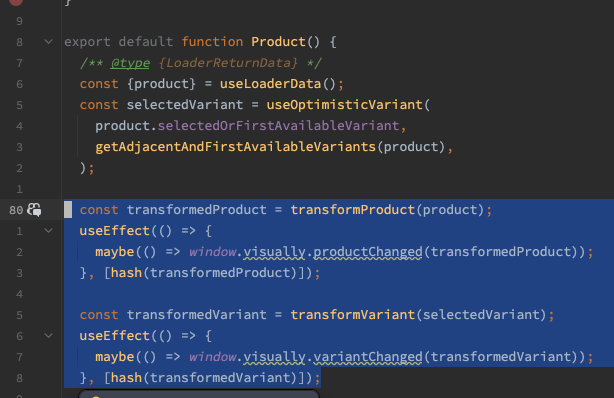
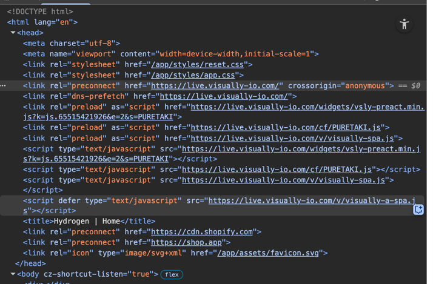

# Visually Reference Project - based on Hydrogen template: Skeleton
---
Based on the quickstart tutorial
https://shopify.dev/docs/storefronts/headless/hydrogen/getting-started

## Visually Integration

- `app/components/Visually.jsx`
Contains most of the logic for the Visually integration.
Visually requires an "Instrument" which allows controlling the store.
Adding to Cart, Opening Cart Drawer, etc.
Visually also needs to "know" when the state of the Store changes, 
for example, when an item is added to the cart, a pdp is changing, user selecting a specific variant, etc.
We use this information both to allow audience targeting and collecting analytics.

## Key Integration Points
- Adding the visually.io script to the page

- Configuring the api key and the store alias
  In the above example: PURETAKI is the alias
  and 65515421926 is the key

- White listing visually io domain scripts in the CSP header

  at app/entry.server.jsx
- Notify visually when a pdp is loaded with its specific info and also when a variant is selected


## Notice !

Visually Scripts are intentionally at the top of the `<head>` in the document.
In order to prevent flickering and delays our javascript sdk needs to run as fast as possible on every page load.


---
# Running the project:

- **Requirements:**

- Node.js version 18.0.0 or higher

```bash
npm create @shopify/hydrogen@latest
```

## Building for production

```bash
npm run build
```

## Local development

```bash
npm run dev
```