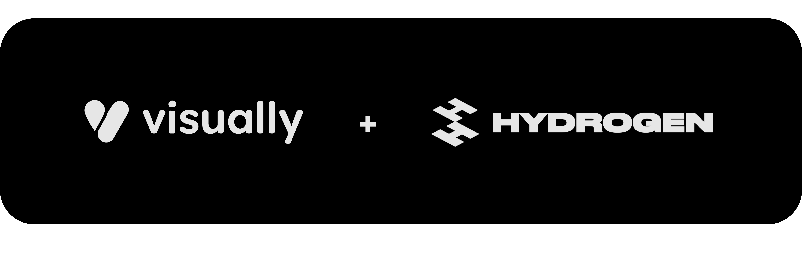

# Visually Hydrogen Reference Project 🦄

This project serves as a reference implementation for integrating Visually with Shopify Hydrogen storefronts.
It demonstrates how to set up the Visually integration to enhance your headless commerce experience.
The example is Based on [Hydrogen quickstart tutorial](https://shopify.dev/docs/storefronts/headless/hydrogen/getting-started):

## Table of Contents

 [Overview](#visually-integration-overview)

 [Integration](#key-integration-points)
  - [Adding Visually Scripts and Configuring Alias/API Key](#adding-the-visuallyio-scripts-to-the-page-head-and-configuring-the-alias-and-api-key)
  - [Allowlisting Visually Scripts in Content Security Policy](#allowlisting-visually-io-domain-scripts-in-the-csp-header)
  - [Initializing the Visually SDK](#initializing-visually-sdk)
  - [PDP and Variant Selection Tracking](#notify-visually-when-a-pdp-is-loaded-with-its-specific-product-and-also-when-a-variant-is-selected)

---

### Visually Integration Overview

Most of the necessary code for the Visually integration is located in a single file:
- `app/components/Visually.jsx` ( [Visually.jsx](app/components/Visually.jsx)) 

<b>It Includes the core functionality of the Visually integration implementation.</b> 
  The integration revolves around two main aspects:

### The "Instrument" 

an interface implementation that provides programmatic control over store operations required for Visually Upsells and Analytics:
  - Cart management (add/remove items, open/close cart drawer, update cart attributes)

> ⚠️ **Important**: Implementing the update cart-attributes method in the Visually instrument  
> is crucial as it serves several essential purposes:
> - Detecting the SPA sales channel
> - Attributing orders to experiences for analytics purposes
> - Advanced Checkout targeting for upsells and recommendations and preview of Checkout upsells
> - Tracking subscription contracts in orders
>
> Make sure this functionality is properly implemented to ensure accurate tracking and analysis.

For the Full list of methods and properties required for the instrument interface, please refer to [Visually.d.ts](Visually.d.ts)

### Store State Reflection. 

Required event tracking for key store changes:
  - Cart modifications
  - Product page navigation
  - Variant selection
  - ...

## Key Integration Points

Or files that import the `Visually.jsx` components and Methods.

### Adding the visually.io scripts to the page <head> And Configuring the Alias and Api key

 - `app/root.jsx` ( [root.jsx](app/root.jsx) )

  

The Alias and Api key can be found in the [Visually dashboard](https://app.visually.io/dashboard) after you install the Visually app.

Account Settings > Manual Script Integration
 

### Allowlisting visually io domain scripts in the CSP header

- `app/entry.server.jsx` ( [entry.server.jsx](app/entry.server.jsx) ) 

Notice that we also need to be allowd as `connectSrc` and also please include the `unsafe-eval` in the `scriptSrc`
Visually uses `eval` in order to generate and execute dynamic javascript.

### Initializing Visually SDK

- `app/components/PageLayout.jsx` ( [PageLayout.jsx](app/components/PageLayout.jsx) )

This component initializes the Visually SDK with the instrument interface and store state reflection.
Its a simple wrapper around a hook `useVisuallyConnect` from `app/components/Visually.jsx` 
In this example it uses the In this example it uses the hydrogen [`useCart`](https://shopify.dev/docs/api/hydrogen-react/2025-04/hooks/usecart) hook. 
It also uses the `useAside()` hook to open and close the cart drawer. 
For this reason it needs to be a descendant of `CartProvider` component. And the `AsideProvider` 
However this is not the only way to implement the instrument interface. 
Your project mau be different and you may use different hooks or even your own custom implementation. 

### Notify visually when a pdp is loaded with its specific product and also when a variant is selected

- `app/routes/products.$handle.jsx` ( [products.$handle.jsx](app/routes/products.%24handle.jsx) )
 

> ⚠️ **Important**: 
Visually Scripts are intentionally at the top of the `<head>` in the document.
In order to prevent flickering and delays our javascript sdk needs to run as fast as possible on every page load.

---
For a comprehensive low-level framework-agnostic guide 
please refer to [SPA-INTEGRATION.md](SPA-INTEGRATION.md)