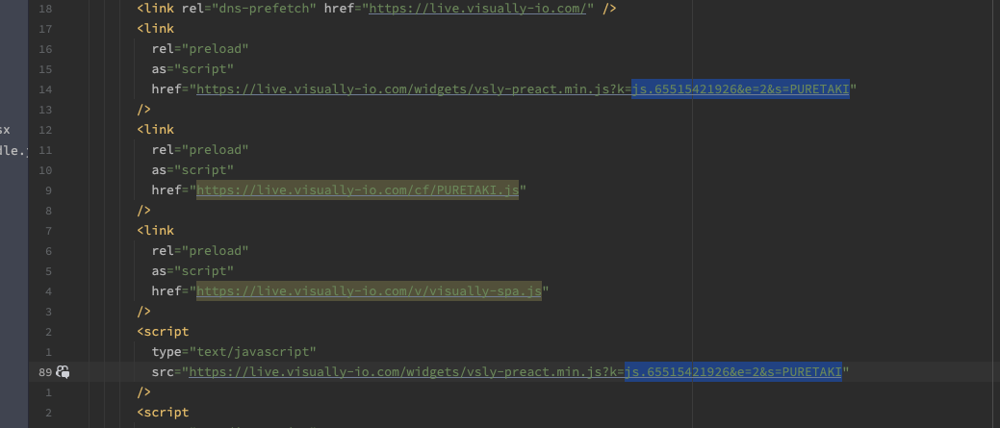

# Visually Hydrogen Reference Project 
---


## Visually Headless Integration

This project serves as a reference implementation for integrating Visually with Shopify Hydrogen storefronts. It demonstrates how to set up the Visually integration to enhance your headless commerce experience.
Based on the following [Hydrogen quickstart tutorial](https://shopify.dev/docs/storefronts/headless/hydrogen/getting-started):

### Visually Integration Overview
- `app/components/Visually.jsx` 

<span style="font-size:1.25em"><b>Details the core functionality of the Visually integration implementation.</b><br/>
  The integration revolves around two main components:</span>

1. The "Instrument" interface—Provides programmatic control over store operations including:
  - Cart management (add/remove items, open/close cart drawer)

2. Store State Reflection—Implements event tracking for key store changes:
  - Cart modifications
  - Product page navigation
  - Variant selection
  - Other relevant state changes

This integration enables essential Visually features including:

- Audience targeting
- Analytics collection
- Dynamic upsell displays

## Key Integration Points
### Adding the visually.io scripts to the page head </br>
  

### Configuring the api key and the store alias
  In the above example: PURETAKI is the alias
  and 65515421926 is the key

### White listing visually io domain scripts in the CSP header

  at app/entry.server.jsx


### Initializing Visually SDK

This component initializes the Visually SDK with the instrument interface and store state reflection.
Its a simple wrapper around a hook `useVisuallyConnect` from `app/components/Visually.jsx`<br/>
In this example it uses the In this example it uses the hydrogen [`useCart`](https://shopify.dev/docs/api/hydrogen-react/2025-04/hooks/usecart) hook.<br/>
It also uses the `useAside()` hook to open and close the cart drawer.<br/>
For this reason it needs to be a descendant of `CartProvider` component. and the `AsideProvider`<br/>
However this is not the only way to implement the instrument interface.<br/>
Your project mau be different and you may use different hooks or even your own custom implementation.<br/>


### Notify visually when a pdp is loaded with its specific info and also when a variant is selected


## Notice !


Visually Scripts are intentionally at the top of the `<head>` in the document.
In order to prevent flickering and delays our javascript sdk needs to run as fast as possible on every page load.


---
# Running the project:

- Node.js version 18.0.0 or higher

```bash
npm create @shopify/hydrogen@latest
```

## Building for production

```bash
npm run build
```

## Local development

```bash
npm run dev
```