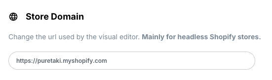

# Visually Hydrogen Reference Project 🦄


This project serves as a reference implementation for integrating Visually with Shopify Hydrogen storefronts.

It demonstrates how to set up the Visually integration to enhance your headless commerce experience.

The example is Based on [Hydrogen quickstart tutorial](https://shopify.dev/docs/storefronts/headless/hydrogen/getting-started):

---


## Table of Contents

 [Overview](#visually-integration-overview)

 [Integration](#key-integration-points)
  - [Adding Visually Scripts and Configuring Alias/API Key](#adding-the-visuallyio-scripts-to-the-page-head-and-configuring-the-alias-and-api-key)
  - [Allowlisting Visually Scripts in Content Security Policy](#allowlisting-visually-io-domain-scripts-in-the-csp-header)
  - [Initializing the Visually SDK](#initializing-visually-sdk)
  - [PDP and Variant Selection Tracking](#notify-visually-when-a-pdp-is-loaded-with-its-specific-product-and-also-when-a-variant-is-selected)

---


### Visually Integration Overview

Most of the necessary code for the Visually integration is located in a single file:
You are encouraged to explore its code to get the feeling of how the integration works.
- `app/components/Visually.jsx` ( [Visually.jsx](app/components/Visually.jsx)) 


<span style="font-size:1.25em"><b>It Includes the core functionality of the Visually integration implementation.</b><br/>
  The integration revolves around two main aspects:</span>

### The "Instrument" 

an interface implementation that provides programmatic control over store operations required for Visually Upsells and Analytics:
  - Cart management (add/remove items, open/close cart drawer, update cart attributes)

> ⚠️ **Important**: Implementing the update cart-attributes method in the Visually instrument  
> is crucial as it serves several essential purposes:
> - Detecting the SPA sales channel
> - Attributing orders to experiences for analytics purposes
> - Advanced Checkout targeting for upsells and recommendations and preview of Checkout upsells
> - Tracking subscription contracts in orders
>
> Make sure this functionality is properly implemented to ensure accurate tracking and analysis.

For the Full list of methods and properties required for the instrument interface, please refer to [Visually.d.ts](Visually.d.ts)


### Store State Reflection

Visually needs to know the current state of the store, including:
  - Current cart state
  - Current product and variant information
  - Current page type (e.g., product page, collection page, etc.)

## Key Integration Points

Or files that import the `Visually.jsx` components and Methods.

### Adding the visually.io scripts to the document <head> And Configuring the Alias and Api key

 - `app/root.jsx` ( [root.jsx](app/root.jsx) )

  

The Alias and Api key can be found in the [Visually dashboard](https://app.visually.io/dashboard) after you install the Visually app.

Account Settings > Manual Script Integration
 

### Allowlisting visually io domain scripts in the CSP header

- `app/entry.server.jsx` ( [entry.server.jsx](app/entry.server.jsx) ) 


Notice that we also need to be allowd as `connectSrc` and also please include the `unsafe-eval` in the `scriptSrc`
Visually uses `eval` in order to generate and execute dynamic javascript.

### Initializing Visually SDK

- `app/components/PageLayout.jsx` ( [PageLayout.jsx](app/components/PageLayout.jsx) )

This component initializes the Visually SDK with the instrument interface and calls relevant sdk methods when the store state changs.
It's a simple wrapper around a hook `useVisuallyConnect` from `app/components/Visually.jsx`<br/>
In this example it uses the hydrogen [`useCart`](https://shopify.dev/docs/api/hydrogen-react/2025-04/hooks/usecart) hook.<br/>
It also uses the `useAside()` hook to open and close the cart drawer.<br/>
For this reason it needs to be a descendant of `CartProvider` component. And the `AsideProvider`<br/>
However this is not the only way to implement the instrument interface.<br/>
Your project may be different, you may use different hooks and your own custom implementation.<br/>

check out the following example: [initialize the Visually ](https://github.com/Loomi-me/hydrogen-reference-project/blob/426b3f92f4fd9c6e9376cd6811ea0c45db1d5699/app/components/Visually.jsx#L31)
it calls `window.visually.visuallyConnect` initialization method with the instrument


#### Tansforming the Cart / Cyrrent product

> ⚠️ **Important**:
> Visually.jsx implements different object transformer functions that receive the cart or current product as parameters,
> and return a transformed object used by the Visually SDK to track the current state of the store.


Your implementation may differ, but the main idea is to provide visually runtime the `Cart` and `Current Product` objects
in the shape it expects.
see [Visually.d.ts](Visually.d.ts) for the full type definitions of the `Cart` ,`CurrentProduct` and `CurrentVariant` objects that should be returned by the transformer functions.

```javascript
// you will probably need to re-implement these functions in Visualy.jsx 
// to transform the cart and product objects to the shape expected by the Visually SDK
function transformCart(cart: Object): CartBase | undefined
function transformProduct(product: Object): CurrentProduct | undefined
function transformVariant(product: Object): CurrentVariant | undefined
```


### PDP

Notify visually when a pdp is loaded with its specific product 
and also when a specific variant is selected

- `app/routes/products.$handle.jsx` ( [products.$handle.jsx](app/routes/products.%24handle.jsx) )
 


### Change the headless url in the Visually Dashboard

To change the url of the headless storefront in the Visually dashboard, follow these steps:

Open the [Account Settings](https://visually.io/shop-settings) page.

Scroll down to the "Store Domain" section and change it to the URL of your headless storefront.
Click the "Save" button to apply the changes.



Once applied the editor will load the store from this url


The left upper corner of the screen will show the current store domain.

---

### Notice

> ⚠️ **Important**:
> Visually Scripts are intentionally at the top of the `<head>` in the document.
> In order to prevent flickering and delays our javascript sdk needs to run as fast as possible on every page load.


---


## Privacy
To respect customer tracking consent, implement the following method:

```typescript
    window.visually.analyticsProcessingAllowed = () => true; // Change this to false if user declined tracking consent
```
This ensures that analytics data is only processed when consent has been granted.
Visually will query the consent status before sending any analytics data.


## Allowed domains

If the SPA has a security mechanism that allows the website to run only on specific domains

We require to add the following domains to the domains 'allowlist'

- visually.io

- loomi.me

- vsly.local:8000

---

# Check List
- add Visually scripts to the document head and configure the alias and api key<br/>
- allow Visually.io scripts domain in the CSP header<br/>
- [initialize the Visually ](https://github.com/Loomi-me/hydrogen-reference-project/blob/426b3f92f4fd9c6e9376cd6811ea0c45db1d5699/app/components/Visually.jsx#L31)SDK with the instrument interface and store state reflection<br/>
  - call `window.visually.visuallyConnect` 
- notify Visually when a PDP is loaded with its specific product and also when a specific variant is selected<br/>
- implement the transform functions to return the cart and product objects in the shape expected by the Visually SDK<br/>
- handle user tracking consent by implementing analyticsProcessingAllowed
- change the headless url in the Visually Dashboard

---
## 🚀 Visually.io MCP Server Integration

✨ **Access our MCP server:** [https://gitmcp.io/Loomi-me/hydrogen-reference-project](https://gitmcp.io/Loomi-me/hydrogen-reference-project)

### 🔧 Adding to Your Development Environment

You can easily add this to your development environment using Cursor. Here's an example configuration:

```json
{
  "mcpServers": {
    "hydrogen-visually": {
      "url": "https://gitmcp.io/Loomi-me/hydrogen-reference-project"
    }
  }
}
```

With this configuration, Cursor can interact with the tool and help with the integration, making your development process smoother and more efficient! 🎉

---

For a comprehensive low-level framework-agnostic guide 
please refer to [SPA-INTEGRATION.md](SPA-INTEGRATION.md)

If you have any more questions or need any help, please don't hesitate to reach out to us.

---

# HOW TO QA
After you finished the integration, you can test it by checking the following:


- CSP - open network tab and search for "visually"!


If you see something like this, not good. You CSP settings block our scripts. Please refer to the [CSP section](#allowlisting-visually-io-domain-scripts-in-the-csp-header)
- *allocate* call is made:
  `https://live.visually-io.com/api/allocator/web/public/v2/allocate?q=eyJjYXJ0Q3...`
The network tab should include the following call. Its the call that fetches the A/B tests and experiments.
If you dont see it. It probably means that you did not call  `window.visually.visuallyConnect` with the correct tool.
Specifically: `window.visually.addCartItem` run this in the console.
After a page load our sdk awaits to be initialized. You provide the instrument which contains the method that allows adding items to the cart.
This method is then assigned to to the `window.visually` object.
Without this method defined we know that the sdk is not initialized.
- check that `window.visually.addCartItem` works by calling it with a variant id from browser console.
- check that the cart is updated after each change.
  `window.loomi_ctx.cart` should contain the cart object. 
This object is essential since its being used by the sdk to track the cart state.
It should look like this: ( a summery of the essential parts of the cart object )
```json
{
    "token": "hWN21BQ2khassPiM4Bc4pZaM?key=cdb90c0fd30011d01adbb50f57fb2943",
    "attributes": {
        "vslyCT": "vslyCT_hWN21BQ2khassPiM4Bc4pZaM?key=cdb90c0fd30011d01adbb50f57fb2943",
        "vslySUBS": "0",
        "vslyUID": "171grsock5",
        "vslySID": "5140370364229706"
    },
    "original_total_price": 16995,
    "total_price": 16995,
    "total_discount": 0,
    "total_weight": 0,
    "item_count": 1,
    "items": [
        {
            "id": 45201616502940,
            "quantity": 1,
            "variant_id": 45201616502940,
            "price": 16995,
        }
    ],
    "currency": "USD",
    "items_subtotal_price": 16995
}
```
- - The cart has attributes beginning with `vsly`
Those are attributes that the Visually SDK adds to the cart for different reasons.
The important part is that they exist, if you dont see them. It means that you did not initialize the sdk correctly. The instrument you provided did not provide the `cartAddAttributes` method that allows us to add the above attributes.
- - After adding an item to the cart, the cart should be updated. ( you had to implement a hook that notifies our sdk with every cart change )
- - note that the prices are in cents

All the above should be valid on a fresh page load. On PDP, PLP, PDP, CART PAGE and any other page like a blog or page or a special landing page.


If all the above is valid you can test running your first A/B test !

Open visually.io editor and create a new test.
- the test should have a single variant for simplicity. 
- it should add an upsell somewhere on a page.
- set an audience for the upsell of users with at least 1 line item in the cart.
- Preview the experience
- - since you dont have anything in the cart you shold not see the upsell
- - add a line item to the cart
- - the upsell should appear
- -  use the `Add to cart` button in the upsell to add the item to the cart and see that it works as expected. 
  - the item should be added to the cart and the store front should reflect the change.

Congrats ! your first A/B test is running!